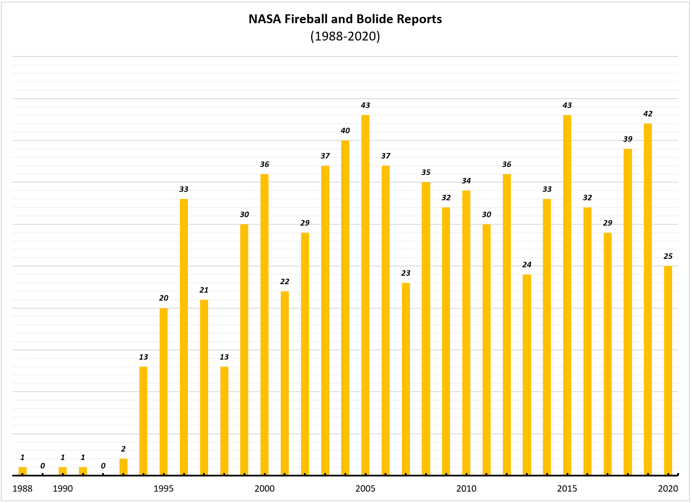

# Welcome! Thank You for Visiting!!
# I am Thomas, this is my GitHub Page
## (tmb321.github.io)

#### _I am originally from Wyoming. I am currently an undergraduate studying at Lehigh Univeristy in Pennsylvania_
#### For more about me check out [My LinkedIn Page](https://www.linkedin.com/in/tmbjr/)

Right now this page is for my Data Storytelling Projects

***
***
## A Project on Creating Charts from Data of Personal Interest

Creating Bar Graph from the [NASA Fireball and Bolide Reports on Datastro](https://www.datastro.eu/explore/dataset/nasa-fireball-and-bolide-reports/table/?sort=date)

_[A Helpful YouTube Video for Moving Images to your GitHub Page](https://www.youtube.com/watch?v=hHbWF1Bvgf4)_

***
***
## Explorations of Parse Hub's Ability to Pick Data 
[The Racial Profiling Search Results](https://www.aclu.org/search/%20?f[0]=field_issues:245)

## All 667 Records on Racial Profiling are Organized into Downloadable Excel Workbook
#### Organization of the Fields: Title, URL, Publication Date, and the Media Type (out of nine possible)

With three sheets: One organized by Date of Publication: the Second by The Nine Media Types in Assenting Order: the Third is For You to Sort However You Would (right click the field heading and communicate your preference for viewing the data)

If a search result interests you and/or you would like to explore the different Media Types, Click on the URL of that record, you will be able to copy it. 

**[RacialProfiling_Assignment_ParaseHub_Results_All667.xlsx](https://github.com/tmb321/tmb321.github.io/files/5036976/RacialProfiling_Assignment_ParaseHub_Results_All667.xlsx)**

_Here I used ZenHub, a New Issue, dragged and droped the file into the Issue, waited for ZenHub to convert the input, copied the output and pasted it just above to create this downloadable link (right above this explination)_

<iframe width="750" height="550" frameborder="11" scrolling="no" src="https://onedrive.live.com/embed?resid=C126330A4DE07B19%21119&authkey=%21AAogi7nXDyclDUw&em=2&wdHideHeaders=True&wdDownloadButton=True&wdInConfigurator=True"></iframe>

##### For more freedom with the data, you may download the sheet a second way. 

##### Use the First Icon on the right side of the bottom dark gray bar^^

##### [For A Help Video on the Method Used to Embed the Sheet Please Click Here](https://youtu.be/1lgyFIPvmNU?t=140)
 
***
***
## A Project to Explore Google Virtual Tour
 
### Take a Dive into the ***Vitality of Water:*** 
#### The Visible Impact of Natural or Irraged Water Introduction for Vegitation Growth

*To See my Drone's Perpective* in Better Detail: Click the Gray [Icosahedron (I believe)](https://www.math-salamanders.com/list-of-geometric-shapes.html#Triangles) in the top Left of the Frame To View This Tour in Full Screen on Poly.Google or click **[HERE](https://poly.google.com/view/4lnbRipNq2c)**

<iframe width="1000" height="500" src="https://poly.google.com/view/4lnbRipNq2c/embed?chrome=min" frameborder="10" style="border:black;" allowvr="yes" allow="vr; xr; accelerometer; magnetometer; gyroscope; autoplay;" allowfullscreen mozallowfullscreen="true" webkitallowfullscreen="true" onmousewheel="" ></iframe>
---
#### Audio Files

##### *Site 5 & Site 3*

<audio controls><source src="GoogleVirtualTour_Extra/WaterVitalityAudio/IrrigatedHighCountry.mp3" type="audio/mpeg"></audio><audio controls><source src="GoogleVirtualTour_Extra/WaterVitalityAudio/DryHighCountry.mp3" type="audio/mpeg"></audio>

##### *The Green River & The High Country Wind*

<audio controls><source src="GoogleVirtualTour_Extra/WaterVitalityAudio/River.mp3" type="audio/mpeg"></audio>
<audio controls><source src="GoogleVirtualTour_Extra/WaterVitalityAudio/WindHC.mp3" type="audio/mpeg"></audio>

---

### [USGS DATA For Green River's Volumtric Flow Rates and Gage Height](https://waterdata.usgs.gov/monitoring-location/09188500/#parameterCode=00060&startDT=2020-07-17&endDT=2020-08-12)

 
##### You Can Either Use Controls Built Into The PDF Frames

---
_**Or For Examples of Short Cuts:**_

_Ctrl + Scroll = Zoom_

_Normal Scroll = Up and Down_

_Shift + Scroll = Left and Right_

PreReqs: [Hover Your Mouse of the Frame]

---
### Calculations with Links to Source Information
<iframe width="1000" height="500" src="GoogleVirtualTour_Extra/BeefPoolCalc.pdf"></iframe>

#### Wyoming Ecoregion Map and Legend With Evident Borders
#### The Location of the virual tour is in 18c Pinedale in the Mid-West Part of the State

<iframe width="1000" height="1000" src="EPA & NOAA/Ecoregions of Wyoming_Map&Legend.pdf"></iframe>
 
#### Same Map: Additional Details on the Right (Look for 18c in the Second Salmon Pink Box "Wyoming Basin")

<iframe width="1000" height="1000" src="EPA & NOAA/Ecoregions of Wyoming_PosterFront.pdf"></iframe>
 
#### Summary Table: Characteristics of the Ecoregions of Wyoming
For 18c Ctrl + Scroll into the *Larger Salmon Pink Box* "Wyoming Basin"

<iframe width="1000" height="1000" src="EPA & NOAA/Ecoregions of Wyoming_PosterBack.pdf"></iframe>

#### Cloud Chart
**Use the Rotate _Clockwise Circlar Arrow_** in the Top Right Drop Down of this Frame to Properly View this PDF

---
**OR For Some More Short Cuts**

Ctrl + ] = Clockwise Rotation

Ctrl + [ = Counter-Clockwise Rotation

PreReqs: [You will have to click on this one before using short cuts]

---
 
In The Tour: I reference the Cumulus Clouds (Low Clouds) In Green
 
<iframe width="1000" height="750" src=" EPA & NOAA/NOAA_cloud_chart.pdf" allowfullscreen></iframe>

---

***
***
## Twitter Data Set 

### #Space: Twitter Data in the Over 7 Days: August 10-17, 2020

[Data GitHub Link](https://github.com/tmb321/tmb321.github.io/blob/master/TwitterData/%23space_tweets_table_Aug10-17_2020.csv)

[Data OneDrive Link](https://1drv.ms/x/s!Ahl74E0KMybBfNOCYC2zuCmtr6E?e=Cmzf6I)

#### Embeded OneDrive Frame
<iframe width="750" height="250" frameborder="0" scrolling="no" src="https://onedrive.live.com/embed?resid=C126330A4DE07B19%21126&authkey=%21ADDlu2n1r8nxL0Y&em=2&wdAllowInteractivity=False&wdDownloadButton=True&wdInConfigurator=True"></iframe>

#### Here is a Static Map of The Locations of Each of these Tweets that used #Space

## Twitter Data Interative Map: Via Tableau Desktop

##### place holding

##### place holding2

   <noscript>
    
   </noscript>
 <object class='tableauViz'  style='display:none;'>
  <param name='host_url' value='https%3A%2F%2Fpublic.tableau.com%2F' /> 
  <param name='embed_code_version' value='3' /> 
  <param name='path' value='shared&#47;77FHS88CY' /> 
  <param name='toolbar' value='yes' /><param name='static_image' value='https:&#47;&#47;public.tableau.com&#47;static&#47;images&#47;77&#47;77FHS88CY&#47;1.png' /> 
  <param name='animate_transition' value='yes' /><param name='display_static_image' value='yes' /><param name='display_spinner' value='yes' />
  <param name='display_overlay' value='yes' /><param name='display_count' value='yes' />
  <param name='language' value='en' /></object>

                
  
  

##### place holding3

 <noscript>
  
 </noscript><object class='tableauViz'  style='display:none;'><param name='host_url' value='https%3A%2F%2Fpublic.tableau.com%2F' /> 
 <param name='embed_code_version' value='3' /> <param name='path' value='shared&#47;77FHS88CY' /> <param name='toolbar' value='yes' /><param name='static_image' value='https:&#47;&#47;public.tableau.com&#47;static&#47;images&#47;77&#47;77FHS88CY&#47;1.png' /> <param name='animate_transition' value='yes' /><param name='display_static_image' value='yes' /><param name='display_spinner' value='yes' /><param name='display_overlay' value='yes' /><param name='display_count' value='yes' /><param name='language' value='en' /></object>

                

##### place holding4

<noscript></noscript><object class='tableauViz'  style='display:none;'><param name='host_url' value='https%3A%2F%2Fpublic.tableau.com%2F' /> <param name='embed_code_version' value='3' /> <param name='path' value='shared&#47;9BZBTHF93' /> <param name='toolbar' value='yes' /><param name='static_image' value='https:&#47;&#47;public.tableau.com&#47;static&#47;images&#47;9B&#47;9BZBTHF93&#47;1.png' /> <param name='animate_transition' value='yes' /><param name='display_static_image' value='yes' /><param name='display_spinner' value='yes' /><param name='display_overlay' value='yes' /><param name='display_count' value='yes' /><param name='language' value='en' /></object>
                
